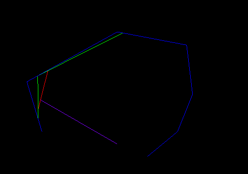
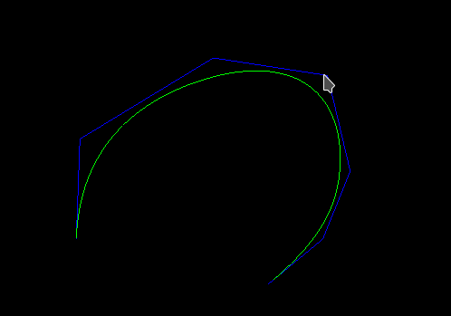

# B-spline > Bezier converter

Converts B-spline spline of arbitrary degree to Bezier representation.

View of a single point drawn by constructive deBoor algorithm.

Using Bohm algorithm, additional knots are inserted until
every piece of a B-spline is converted into a Bezier curve.

